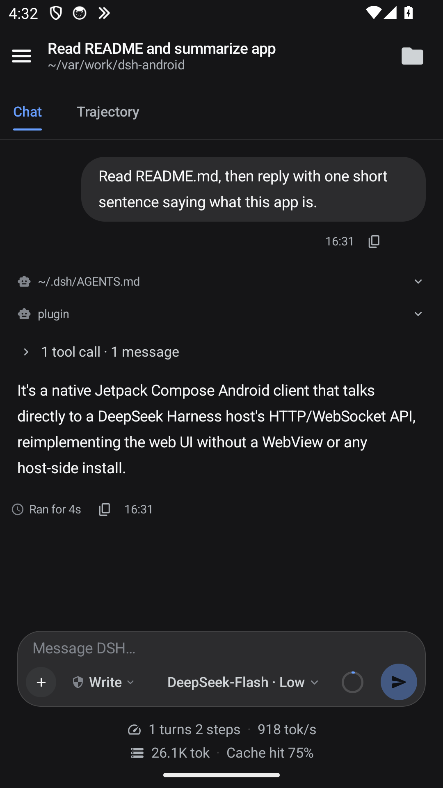
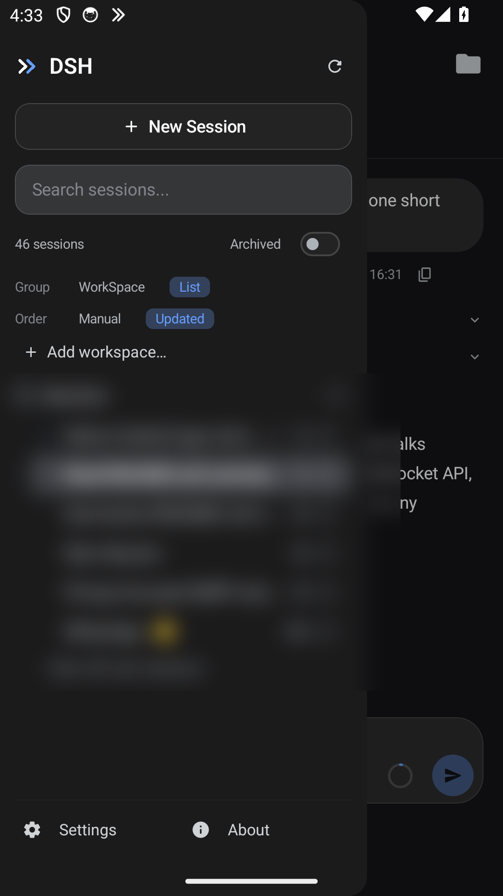
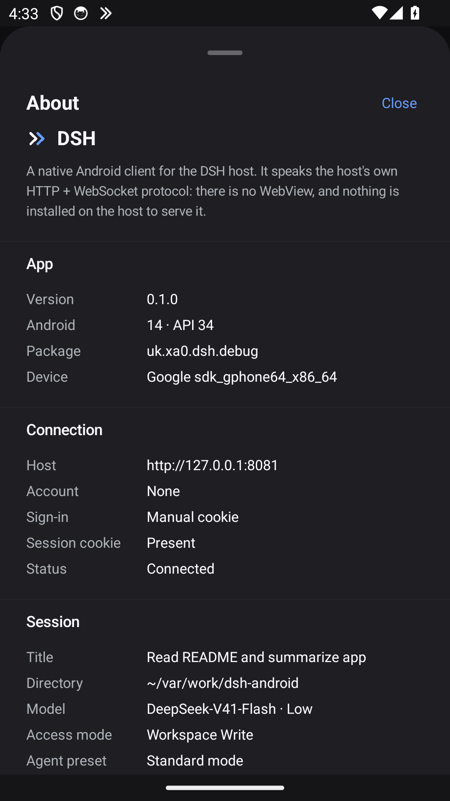
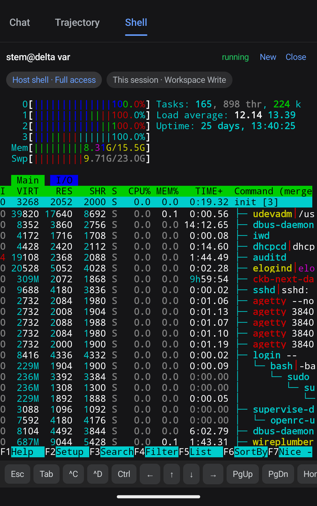

# DSH — native Android client

A native Jetpack Compose Android client for a DeepSeek Harness (DSH) host. It
reimplements the official DSH web UI **without a WebView and without installing
anything on the host**: every call it makes is one the web client already makes,
against the host's own public HTTP + WebSocket API.

The wire protocol, not the DOM, is the interface. Nothing is injected into the
host and no host-side plugin is required.

<p align="center">
  
</p>

A conversation. The agent's process folds under one summary line (`1 tool call · 1
message`), the prompt's context travels with it as its own rows, and the session's
own statistics sit under the composer. The Trajectory tab beside Chat shows the
same turn as the model saw it — input, tool use, result.

<p align="center">
  
  &nbsp;&nbsp;
  
</p>

The drawer groups sessions by the host's own Workspace registry rather than by
guessing from paths, and its footer pairs **Settings** — which holds only things
that are actually settable — with **About**, which holds everything that is a fact
about the app instead: the host, the sign-in mode, the version, the platform, and
the open session's route. (The session list is blurred in that shot; it is
someone's, and not this repository's.)

One shot is still owed: the Shell tab, showing a terminal with `htop` running in
the host-shell seat, in dark mode.

## Requirements

- **Android 8.0 (API 26) or newer.** `minSdk` is 26; `compileSdk` and `targetSdk`
  are 34, built with build-tools 35.0.0.
- **JDK 17 and Gradle 8.7**, unpacked under `.toolchain/` as
  `jdk-17.0.20.1+1` and `gradle-8.7`. `build.sh` expects those two directories to
  already exist; it does not download them.
- **An Android SDK** with platform 34 and build-tools 35.0.0. `local.properties`
  points `sdk.dir` at it (`sdk.dir=/opt/android-sdk` on the development box), and
  `build.sh` additionally exports `ANDROID_HOME`/`ANDROID_SDK_ROOT`.
- There is **no Gradle wrapper**. `build.sh` is the entry point for every Gradle
  invocation, and it redirects `GRADLE_USER_HOME`, `ANDROID_USER_HOME` and
  `XDG_DATA_HOME` into `.toolchain/`, so the build writes nothing to `$HOME` and
  works inside a workspace-write sandbox.
- Hosts are normally reached over plain HTTP on a private LAN; the app's network
  security config permits cleartext so a typed `http://` URL works.

## Build and install

```sh
bash build.sh :app:assembleDebug
# -> app/build/outputs/apk/debug/app-debug.apk

bash build.sh :app:testDebugUnitTest
# 230 tests, all JVM: the VT parser, the protocol gates and the key tables
```

The suite (`app/src/test/java/…`) exists because the VT core and the terminal's
ordering gates are pure Kotlin with no Android in them: the half of the feature
a build box cannot exercise on a device is pinned down against bytes instead.

CI runs that suite and builds the same APK on every push to `main` and every pull
request, so an APK can be had without the local toolchain at all:

- the **Actions** tab → the *Build* workflow → the run for your commit →
  **Artifacts** → `dsh-android-debug-<sha>`, or
- the run's summary, which names the file and its size.

That APK is signed with the standard **debug** key, so it installs over an
existing debug build (`uk.xa0.dsh.debug`) without uninstalling it — the same
package the local build produces. `.github/workflows/build.yml` only reproduces
the `.toolchain/` layout and then calls `build.sh`, so local and CI builds cannot
drift apart.

Install it to one device:

```sh
tools/install.sh <serial>              # installs the debug APK just built
tools/install.sh <serial> <apk>        # or an explicit APK
```

- `build.sh` takes the build lock (`.build.lock`) itself, and `tools/install.sh`
  takes `.install.lock`; both live in the checkout because `flock` on `/tmp` is
  not a mutex here. A second caller waits rather than interleaving.
- Debug builds carry the `.debug` application id suffix
  (`uk.xa0.dsh.debug`).
- `adblease <serial> <command...>` runs a whole device sequence — install,
  launch, tap, screencap — under one per-device lease, so two verification runs
  cannot split each other halfway. `$SERIAL` and `$ADB` are exported to the
  command. It is generic device infrastructure, so it lives outside this
  checkout with the rest of the adb plumbing (`~/bin/adb-wireless`):

  ```sh
  adblease 127.0.0.1:5555 sh -c 'adb -s $SERIAL shell input tap 48 128'
  ```

## Point it at a host and sign in

Set **Server** to the address of the host's HTTP door, e.g.
`http://192.168.1.110/`. A bare `host:port` is accepted and gets `http://`.
There are two ways in:

1. **The host's login form.** Enter an account and password; the app posts
   `application/x-www-form-urlencoded` to `POST /auth/login` with
   `provider=password`. The host answers with its session cookie, and nginx in
   front of the harness also injects the `dsh-auth-*` cookie. Both are kept in a
   `CookieJar` that survives process death and are replayed on every later call.
   The password is stored in `EncryptedSharedPreferences` (AES-256-GCM, key in
   the Android Keystore) so an expired session is re-signed-in silently instead
   of dropping the open transcript back on the setup screen.
2. **A pasted cookie.** The **Advanced** field on the setup screen takes a raw
   `name=value` cookie (`dsh-auth-…` or `dsh_auth_session=…`) and bypasses the
   form. This is the path for a host reached directly on its carrier port, which
   has no `/auth/login` door; leave the account blank.

**When the host cannot be reached**, nothing logs you out. A timeout, a refused
connection or a dropped socket is treated as transient: a first connect stays on
the setup screen with the host's message and retries after 3/6/9/12 seconds, and
a drop on a live screen keeps the transcript visible with a banner while the
mux reconnects. Only an HTTP 401/403 (or a redirect to the login page) is a
credential refusal, and only that offers sign-in again.

**Emulator pointed at a host on the same machine:** the emulator's own
`127.0.0.1` is the emulator, not the host, so address the host through the
emulator's NAT alias: **`http://10.0.2.2:8081/`**. (The carrier port is also
reversed in with `adb reverse tcp:8081 tcp:8081`, which the `adb` user service
applies to every emulator that registers — but on this box's emulator that relay
registers without carrying bytes, so do not rely on `127.0.0.1:8081` from inside
it. Details and the measurement are in `docs/HANDOFF.md`.) Either way, paste the
carrier cookie — the loopback carrier has no login form.

## Wire protocol

Unary calls are `POST /api/<namespace>/<method>` carrying the harness envelope:

```json
{"type":"client-request","rpcId":"…","method":"session/list","payload":{"args":{…}}}
→ {"type":"server-response","rpcId":"…","result":{"ok":true,"value":{…}}}
```

Argument keys are the **host service method's parameter names**, which is why
`session/list` takes `_request` while `session/prompt` takes `request`.

Everything streaming rides one WebSocket, `/api/remote.mux`, carrying logical
streams:

```
→ {"type":"open","streamId":"s1","endpoint":"session/follow","payload":{"args":{…}}}
← {"type":"item","streamId":"s1","value":{…}}
← {"type":"end","streamId":"s1"}
```

Four endpoints are used:

- `session/follow` — transcript `snapshot`, durable `event` frames, and live
  `assistant-stream` `start`/`chunk`/`end` frames (token deltas).
- `session/control` — one `baseline` plus `queue` / `projection` / `jobs` deltas
  for every session: the pending queue, background jobs and folded projections.
- `workspace/follow` — the workspace registry the drawer groups by and the
  directory picker adopts from.
- `$events` — forwarded host events, including **waterfalls** such as
  `approval/request` and `user-questions/request`. A waterfall must be answered
  or the agent stalls; it is settled with `POST /api/$events/result` carrying
  `{clientId, eventId, outcome}`.

`RemoteMux` replays its open registrations after a reconnect, so a dropped
socket resumes streaming instead of silently freezing the UI.

## What the app does today

### Sessions and the drawer

- Workspace grouping from the host registry, plus the host's **Ungrouped**
  bucket; Group by Workspace/List, Order by Manual/Last updated, per-section
  collapse and "Show more" paging, an Archived filter, and subagent sessions
  nested under their parent with a per-row subagent disclosure. All three drawer
  preferences persist across restarts.
- Local title/path filter over the roster plus host content search
  (`session/search`), debounced 250 ms and merged in the host's order.
- Status dots: the ongoing square chase, green done, amber warning. Rows that
  finished while you were elsewhere keep a client-side "done" marker until you
  open them.
- Session row actions: **Rename**, **Fork session** (`session/fork`), **Copy
  session id**, **Archive** (`workspace/archiveSession`); Settings unarchives.
- New Session from the hero screen (cwd and workspace resolved against the
  registry), and **Add workspace** through the directory picker
  (`directoryPicker/list`, `directoryPicker/createDirectory`, `workspace/create`).
- Refresh (with a minimum spin so a fast host does not look like a no-op),
  Settings, and New Session in the drawer footer.

### The transcript

- User bubbles, assistant markdown, collapsible "Think" reasoning with a live
  "Thinking…" line, plan/todo cards, plugin and error notices, compaction
  markers, and subagent lineage.
- Per-tool cards: bash/pwsh terminal, write/edit diff, read with line ranges,
  an image the agent read drawn inline, grep/glob hit lists, `web_search` /
  `web_fetch`, and the question/answer record for `ask_user_question`. Nested
  sub-calls render as a tree; anything else falls back to the generic
  disclosure with IN/OUT cards.
- Live token streaming with throttling so hundreds of deltas per second stay
  smooth; a per-turn process fold with a summary; a "Deep diving…" status with
  an elapsed clock; per-message clock and copy actions; a back-to-bottom button.
- Chat / Trajectory / Shell view tabs: the second is the model's input/output
  ledger, the third the session's PTY (see *The Shell tab*, below).
- Back-pagination: scrolling to the oldest loaded row pulls one older page with
  `session/page`, so a long session is not capped at the follow window.
- A deliverables row after each finished turn, opening the text preview.
- A background-jobs seat in the header for the session in front of you: the
  running jobs and their states, fed by the `jobs` delta of `session/control`,
  with a "done" marker for a job that settled while you were in another session.
  The count is the *open* session's, never the last session that happened to
  report.

### The Shell tab

- The view strip is **Chat / Trajectory / Shell**. The third is a real PTY over
  the host's native `terminal` Remote namespace (`environment`, `shells`, `list`,
  `create`, `follow`, `write`, `resize`, `rename`, `close`), streamed on the same
  `/api/remote.mux` the transcript uses. It is labelled **Shell** rather than
  Terminal because it hosts two *seats*, and it is a client view over that
  namespace rather than a host-registered view — the same material the web
  client's own terminal panel is assembled from (`docs/research/chrome-ui.md`
  §5.3).
- **Host shell · Full access** is the default seat: one dedicated Session per
  workspace, created at the workspace root, given `danger-full-access` *before*
  any terminal exists in it, then archived so it never sits in the drawer. The
  order is the feature. `terminal/create` takes the shell's confinement from the
  *Session's* policy, and the host refuses a mode change while a terminal is open
  in that session — "Close browser terminals before changing the Session sandbox
  mode" — so a terminal opened first would be a confined shell behind a seat
  labelled "Full access". A session that is in no workspace opens its host shell
  at the session's own cwd rather than guessing a workspace root.
- **This session · Workspace Write / Read Only** is the session's own terminal,
  confined by whatever policy that session runs. The two seats exist because
  confinement is the *session's* policy with no per-terminal override: under
  `workspace-write` the host wraps the shell in bwrap (`--ro-bind / /`,
  `--unshare-pid`, `--tmpfs /tmp`, and only the workspace bound writable), so
  the filesystem is read-only to it and `htop` sees only its own PID namespace.
  The host shell is the escape from that, per workspace, without moving the mode
  of the session the user is working in.
- Each seat chip carries the policy in force in it ("Host shell · Full access",
  "This session · Workspace Write"), which is what replaces a one-off "this
  terminal is sandboxed" notice: the shell in front of you is named by what it
  can touch, and the chips are re-labelled when the session's access mode moves.
- The grid is one `Canvas` with a block cursor — a 100×40 screen is 4,000 cells
  and `htop` repaints most of them several times a second — with a key row for
  the keys a soft keyboard cannot produce: `Esc`, `Tab`, `^C`, `^D`, a `Ctrl`
  latch, the arrows, `PgUp`/`PgDn` and `Home`/`End`. A session that retains more
  than one terminal gets a chip per terminal; one grid is on screen at a time.
- The VT core (`app/src/main/java/uk/xa0/dsh/term/`) is hand-written and
  Android-free: incremental UTF-8 across chunk boundaries, cursor addressing,
  EL/ED, insert/delete line and char, DECSTBM scroll regions, `?1049` alternate
  screen with save/restore, `?25`/`?7`/`?6`/`?1` and ANSI insert mode, SGR
  through 16/256/truecolor, the `ESC(0` ACS line-drawing table, DSR/DA answers
  written back to the PTY, and a bounded scrollback.
- **Verified on the emulator** — the qualification is the point: the grid follows
  the panel (`stty size` agreed at 16×56 against the panel's 56×16), a 287-column
  line wraps, after `seq 1 60` the last sixteen rows are visible with the prompt
  on the bottom, `htop` renders unconfined in the host shell (165 tasks, box
  characters, no phantom cursor), `exit` reports a stopped shell, and the
  terminal picker distinguishes two terminals. **Re-attach after a network drop
  is unverified**: the emulator's `svc wifi/data` do not touch the path this app
  uses (eth0/10.0.2.15), so a drop-and-resume has not been exercised.

<p align="center">
  
</p>

### The composer

- Send, and stop while a turn runs. While running, a long press on send chooses
  **queue** or **steer**; the default is a preference in Settings.
- Model chip and picker grouped by provider, including the reasoning-effort
  options a route accepts; agent-preset chip and picker (`agentPresets/list`);
  access-mode chip and picker (`permissionPresets/catalog`, applied through the
  host's `/permission` command); a Plan chip that leaves plan mode.
- Context meter with a token-breakdown dialog, and session statistic pills
  (turns/steps with throughput, and token usage with cache-hit), each opening a
  detail panel.
- Docks above the card: approval (Allow once / Reject), questions (options,
  multi-select, custom text, plan review), to-dos, goal bar
  (pause/resume/edit/clear), and the queue dock (edit, remove, steer, with a
  local "Sending…" echo until the host admits the row).
- Attachments: the `+` button opens the add/command menu, the system file picker
  stages a file as an upload receipt (`fileUploads/upload`) or sends an image
  inline as `{type:"image"}`. A picture can be sent with no caption.
- `/` opens the host's command roster (`commands/list` → `commands/execute`);
  `@` opens the reference picker (`fileReferences/list`,
  `sessionReferenceResolver/candidates`). Both are caret-accurate and insert the
  mention at the token, not at the end of the draft.

### Files

- The header folder seat opens the session's Files panel: the files the
  transcript touched, with a numbered text preview. Content the transcript
  already carries is preferred; anything else is read with
  `workspaceFiles/read`, scoped to the open session.
- Deliverable chips open the panel on the file they name.

### Settings

- A read-only port of the web settings modal's five sections — General, Models,
  Plugins, Agent presets, Archived sessions — plus Connection and Session
  sections for this client's own facts.
- Live controls are the client-local ones: theme (system/dark/light), busy-Enter
  behaviour, the new-session default preset, and Archived-session unarchive.
  Everything that would need a host settings write is shown as a value, because
  a remote browser lands in a `memory` settings scope where writes are dropped.
- Sign out clears the cookie jar and the stored credentials.

### Background behaviour

- A `dataSync` foreground service holds the event socket open with no Activity,
  so an approval or a question still reaches a pocketed phone. Its ongoing
  notification is LOW importance on its own "Connection status" channel.
- A separate notifications channel carries approvals, questions, a session going
  idle/done, session errors and a blocked goal. Each deep-links to its session.
- `POST_NOTIFICATIONS` is requested on Android 13+, and the battery-optimisation
  exemption is offered, because an OEM battery manager otherwise reaps the
  process and the socket with it.

## Deliberate divergences and gaps

`docs/PARITY.md` is the element-by-element ledger; the short version:

- Notices render as visible rows where the web hides them inside a collapsed
  turn process — a touch UI has no `hidden="until-found"` reveal to get them
  back.
- A typed note alongside a single-select question is sent together with the pick
  (`{selected, custom}`); the web clears one when you touch the other.
- Settings is read-only apart from client-local preferences (see above).
- Not implemented in the terminal: scrollback *rendering* — the tail is retained
  but not drawn — mouse reporting, terminal search, more than one terminal on
  screen at a time, sixel/kitty graphics, OSC 8 hyperlinks, bracketed paste and
  IME composition regions.
- Not implemented elsewhere: the right-panel tab strip beyond Files,
  drag-to-reorder and the drawer's bottom fade, and Markdown
  images/citations/mermaid/math.
- The jobs "done" marker lives in memory: restarting the app clears it, and a job
  that settled while the app was closed is not re-announced, because a session's
  first observation never marks it — the rule that keeps one session's job from
  lighting a dot on another.
- `session/selectModel` moves the host's **global** default model, not just the
  open session's, so a model picked here changes every session's, in every client.
- One host-side limitation the app cannot fix: a waterfall is fanned out to
  every registered `$events` client and settles only once each has answered, so
  a Skip or an approval is decisive only while this app is the sole event client
  (an open browser tab keeps it pending).

## Repository map

```
app/src/main/java/uk/xa0/dsh/
  data/    Encrypted config store: host, credentials, theme, drawer preferences
  net/     DshClient (cookies + unary RPC), RemoteMux (the stream mux), TerminalClient (the terminal namespace), PersistentCookieJar
  term/    The VT core and the terminal's own rules: emulator, key encodings, seats, stream gates — no Android, so the JVM suite can drive it
  model/   Journal → renderable rows: transcript reducer, trajectory, files, search, stats, tool tree
  ui/      Compose screens and components: chat, drawer, settings, setup, trajectory, terminal, theme, markdown
app/src/test/java/uk/xa0/dsh/term/   JVM tests for the VT parser, the protocol gates and the key tables
docs/      HANDOFF.md (working state), PARITY.md (parity ledger), research/ (reverse-engineered spec)
tools/     install.sh (APK install), dsh-api.mjs (one gateway RPC over loopback), gh-secrets.py (Actions secrets); the adb/emulator services and the device lease are generic host infrastructure and live outside this checkout
build.sh   Gradle entry point; pins the toolchain, the caches and the build lock
docs/images/  the screenshots above
.github/   Build and Release workflows: the JVM suite and an installable APK per push, and a
           published release per version tag
app/build.gradle.kts, settings.gradle.kts, gradle.properties, local.properties   Gradle and SDK config
```

## Documentation

- `docs/HANDOFF.md` — repository layout, the build and device loop, the traps
  that have cost real time, and what is still open.
- `docs/PARITY.md` — the parity roadmap against the vanilla web UI, including
  every deliberate divergence and the reasoning behind it.
- `docs/research/` — the reverse-engineered reference: design system, wire
  protocol, transcript/UI node model, settings and panels, composer menus,
  notification plumbing, and the mobile-remote environment.
